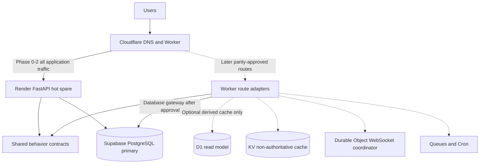

# Dual-platform modernization architecture

Status: Phase 0 implemented; production traffic is not cut over.

## Decision summary

Cloudflare will first become a reversible HTTP edge in front of the unchanged Render FastAPI service. Supabase PostgreSQL remains the sole system of record. This gives the application Cloudflare routing, TLS, observability, and controlled canary capability without duplicating business logic or introducing dual writes.

D1 is not a drop-in replacement for Supabase PostgreSQL. The application currently depends on SQLAlchemy, Alembic, PostgreSQL JSONB and RLS, synchronous sessions, startup data repairs, and relational ownership rules. D1 promotion is blocked until a portable persistence contract, schema translation, data reconciliation, and feature-parity tests exist. KV must not store authoritative calendar or authentication data because it is eventually consistent. R2 is unnecessary until the product stores user binary objects. Durable Objects are reserved for a later WebSocket coordination proof. Queues and Cron Triggers are candidates for sync work only after jobs are idempotent.

## Current-state assessment

| Area | Current implementation | Risk |
| --- | --- | --- |
| Presentation | Jinja templates and static FullCalendar assets served by FastAPI | Worker-native rendering would duplicate behavior |
| Application | FastAPI routers directly coordinate services and SQLAlchemy sessions | Business and persistence concerns are not fully separated |
| Domain | Useful rules exist in `app/services`, but several accept ORM sessions/models | Cannot be consumed directly by JavaScript Workers |
| Persistence | Supabase PostgreSQL, SQLAlchemy, Alembic, startup schema patches | D1 SQL and consistency semantics differ materially |
| Authentication | HS256 JWT, Google OAuth, Microsoft OAuth, encrypted provider tokens | Secret or callback drift would sign users out or break OAuth |
| Real time | FastAPI WebSocket endpoint plus in-process APScheduler | Requires stateful coordination and scheduled execution outside request Workers |
| Operations | Render service exists, but repository previously lacked a Render blueprint | Dashboard-only configuration can drift |
| CI/CD | Python tests existed; Azure deployment workflow is legacy | No unified Cloudflare/Render readiness gate previously existed |

Security debt includes symmetric JWT key distribution, query-string WebSocket tokens, runtime schema mutation, and an application-owner database connection that bypasses RLS. These are migration work items, not phase-zero changes.

## Target architecture



The desired clean architecture is introduced incrementally, not through a repository-wide move that would destabilize Render:

```text
core/
  domain/              # entities and invariants without framework imports
  application/         # use cases and ports
adapters/
  persistence/
    sqlalchemy/        # Supabase/PostgreSQL implementation
    d1/                # optional future implementation
  oauth/               # provider gateways
api/
  fastapi/             # existing route adapters, migrated incrementally
  worker_routes/       # Worker HTTP adapters
platform/
  cloudflare/          # Worker entrypoint and bindings
  render/              # Render runtime integration
deployment/            # target contracts and release checks
tests/
  contract/            # cross-platform behavior fixtures
  failover/            # traffic and recovery tests
```

Python and JavaScript cannot literally import one implementation. "Shared business logic" therefore means one versioned, platform-neutral behavioral contract and fixture corpus, with rules extracted into pure modules where runtime sharing is possible. A rule is not ported to Workers until both adapters pass the same contract fixtures.

## Benefits and tradeoffs

Business rationale: Cloudflare can become the stable public endpoint while Render remains immediately reachable and deployable. This minimizes user disruption and preserves disaster recovery.

Technical rationale: edge proxying is stateless, cheap, independently testable, and reversible by DNS. It creates the route-control plane needed for later canaries without changing persistence or authentication.

Tradeoffs: Phase 0 adds an edge network hop and does not reduce Render compute. Render free instances may sleep, so it cannot meet strict hot-spare recovery-time objectives. Cloudflare and Render free tiers are suitable for low traffic and best-effort availability, not contractual high availability.

## Migration sequence and gates

1. Baseline: inventory API/OpenAPI, environment fingerprints, Alembic head, Supabase row counts, OAuth callbacks, WebSocket behavior, and scheduler health. Gate: all current tests and production smoke checks pass.
2. Edge shadow: deploy the Worker on `workers.dev`; keep public DNS on Render. Gate: HTTP, redirects, cookies, large responses, uploads, and WebSocket tests match Render.
3. Edge canary: route an operator-only hostname through Cloudflare. Gate: seven days without elevated 5xx, auth, or sync errors.
4. Edge primary: move public DNS to Cloudflare with Render as origin. Gate: rollback drill completed and origin hostname monitored independently.
5. Clean architecture extraction: move one use case at a time behind ports while FastAPI behavior remains unchanged. Gate: contract fixtures pass before and after each extraction.
6. Worker-native reads: implement only idempotent read routes first. Keep Supabase authoritative through an approved database gateway. Gate: response, authorization, latency, and load parity.
7. Async work: move idempotent sync jobs to Queues/Cron only after deduplication keys and replay tests exist. Gate: no duplicate provider writes during replay.
8. D1 evaluation: use D1 only as a rebuildable read model initially. Gate: automated reconciliation, measured free-tier fit, restore drill, and explicit architecture approval.
9. Worker-native writes: canary per route; never dual-write in request handlers. Gate: transactional outbox or equivalent replication and zero unexplained reconciliation differences.

## Rollback

Trigger rollback for sustained Worker 5xx above 1%, OAuth callback failures, JWT incompatibility, WebSocket upgrade failures, stale calendar reads beyond the agreed objective, data divergence, or free-tier exhaustion.

For phases 0-4, change DNS/proxy routing back to the Render hostname, verify `/health`, `/health/schema`, login, OAuth callback, calendar read/write, and scheduler health, then preserve Worker logs for analysis. No database rollback is required because Supabase remains authoritative. For later native-write phases, stop Worker writes first, drain queues, reconcile by immutable operation ID, and only then restore route ownership. Never reverse a database migration until a backup and forward compatibility have been verified.

## Cost and scale

| Service | Free-tier role | Cost pressure / limit |
| --- | --- | --- |
| Cloudflare Workers | Edge proxy and low-volume route execution | Request and CPU quotas; outbound origin traffic still consumes Render capacity |
| Cloudflare D1 | Optional rebuildable read model | Storage, row reads/writes, SQLite semantics, and replication design |
| Cloudflare KV | Configuration or disposable cache | Eventual consistency makes it unsuitable for auth/calendar truth |
| Durable Objects | Later WebSocket coordination | Requests, duration, and storage; avoid until measured need |
| Queues | Later idempotent sync dispatch | Operations quota and retention; replay safety required |
| Render | FastAPI origin and hot spare | Free service sleep/cold starts and monthly runtime limits |
| Supabase | Authoritative PostgreSQL | Database size, egress, connection count, and project pausing limits |

Free-tier limits and prices change. Verify current vendor dashboards before each decision gate. The first scale optimization should be fewer provider syncs and database round trips, not an additional authoritative database.

## Assumptions and dependencies

- The existing Render service ID remains separately managed until the blueprint is deliberately linked.
- The public domain can be managed in Cloudflare DNS.
- Supabase remains available from both platforms and is the only writer during early phases.
- OAuth providers permit both the current Render callbacks and future Cloudflare-domain callbacks during canary.
- Cloudflare secrets are configured with `wrangler secret put`; no production secret belongs in Git.
- Azure workflow removal is a separate decision after confirming it is unused.