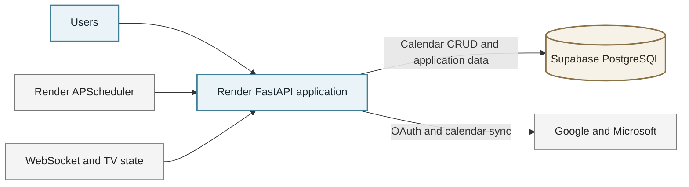
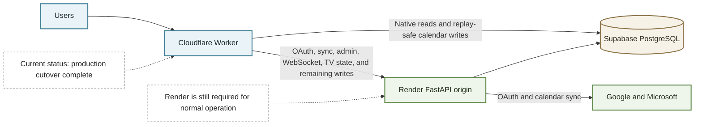
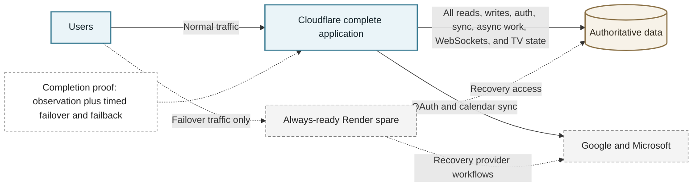

# Migration completion Lego plan

Status: Core Cloudflare production cutover completed on 2026-08-04. This plan retains the remaining literal-charter gates for reliability policy, sustained observation, complete Worker autonomy, and timed failover/failback.

## 2026-08-04 release position

- Production Worker reads are native for calendar, current-user, date-sticky, legacy-event, note, tag-color, task, and TV-version routes.
- Production event, date-sticky, tag-color, standalone note, and standalone task writes are native and replay-safe. Canary note/task writes remain proxy-owned until canary write promotion is approved.
- OAuth, provider sync, scheduler, import, administrative, WebSocket, and TV-state-dependent routes remain intentionally Render-owned.
- Supabase PostgreSQL remains authoritative at Alembic revision `aa981u11nnn55` with least-privilege Worker RLS and hardened replay receipts.
- The reversible production smoke and direct-Render synthetic each passed 23 checks with cleanup. Render recovery remains best effort on the free tier.
- The route migration is complete. The original charter is not literally closed until the final owner/operational gates at the end of this document are completed or formally revised.

## Architecture progression

### 1. Starting point: Render-centered application

All browser traffic and application behavior entered through the Render FastAPI process. Render owned the frontend, calendar API, OAuth, provider sync, scheduled work, WebSockets, and process-local TV state. Supabase PostgreSQL was the authoritative database.

### 2. Current production: secure hybrid cutover

Cloudflare is the public edge and directly owns the database-local calendar paths that are safe to run there. Render remains an active application origin for workflows that depend on provider credentials, scheduling, process state, or the existing FastAPI runtime. Both runtimes use the same authoritative Supabase data.

### 3. Full completion: Cloudflare-autonomous application

The literal charter is complete only when Cloudflare can run every normal user and operator workflow without Render. Render then becomes an independently monitored, always-ready failover target rather than a required origin. A timed failover and failback drill, sustained observation, and an approved reliability policy must prove that architecture.

The second architecture is the deployed release. The third remains the literal completion target; it should not be marked complete while Render handles normal production workflows or while the failover and reliability gates remain open. The owner-led canary setup in Stage C is the penultimate gate before the final completion evidence gate: the timed failover/failback drill and sustained observation that prove the full Cloudflare-autonomous architecture.

## How to use this plan

Complete the blocks in the execution order below. Treat every numbered action as one Lego brick: perform it, save its evidence, and check it off before moving on. Never combine a production cutover with a database, authentication, or business-logic change.

Roles:

- **Copilot** means repository code, tests, scripts, documentation, and evidence preparation.
- **Owner** means a dashboard/account action that requires the user's authenticated session.
- **Automatic** means GitHub CI or a post-deploy check.

Global stop rules:

- Stop on any failed required test, unexplained data difference, OAuth error, calendar-sync error, WebSocket regression, or inability to execute rollback.
- Supabase PostgreSQL remains authoritative until a separately approved write-autonomy gate passes.
- Never place secrets in Git, chat, command arguments, screenshots, or workbook cells.
- Use one reviewed commit per gate. Do not bundle the next gate into the same release.
- Keep direct Render health available throughout Cloudflare work.

## Execution order

| Stage | Workstreams | Why this order |
| --- | --- | --- |
| A | 1, 11, 12 | Establish evidence, security constraints, SLOs, and free-tier limits first. |
| B | 4, 10 | Create shared behavior contracts and automated live checks before routing changes. |
| C | 2 | Run OAuth-capable operator canary with measurable alerts. |
| D | 3 | Make Cloudflare the public edge only after the canary passes. |
| E | 5 | Introduce authenticated Worker reads behind contracts and security controls. |
| F | 6, 7, 13 | Make evidence-based product decisions for async work and optional bindings. |
| G | 8 | Add Worker writes only after reads and data decisions pass. |
| H | 9 | Validate Render as a real hot spare only after Cloudflare is autonomous. |

---

## Stage A1: Production baseline evidence

**Goal:** Produce a dated, reproducible snapshot before changing routing, authentication, or persistence.

**Status (2026-08-02):** Substantially complete under documented exceptions. The owner-assisted captures include Supabase size/status/connections/billing usage, Render deployment/bandwidth/lifecycle/monthly usage, Cloudflare request/error/subrequest/CPU analytics, and fresh authenticated scheduler health plus 28-day sync rollups. Supabase Free Plan egress is 5.346/5 GB (107%) for 2026-07-22 through 2026-08-22; the owner accepted continued operation during the fair-use grace period and directed development and smoke testing to proceed. Restrictions may return HTTP 402 after 2026-08-19 and remain monitored. Render usage is 11.52/750 instance hours and 153 MB/5 GB bandwidth. Exact Render cold-start timing remains explicitly deferred and incomplete, but it does not block repository development or owner-authorized smoke testing. Traffic cutover and direct Worker data access still require their separate gates.

1. **Copilot:** Add a read-only baseline collector under `deployment/` that records schema revision, table names, row counts, scheduler health, sync-efficiency rollups, API/OpenAPI fingerprint, and deployment identifiers. It must mask URLs and all credentials.
2. **Copilot:** Add tests proving the collector cannot print tokens, passwords, connection strings, OAuth secrets, or encryption keys.
3. **Owner:** Create a short-lived read-only Supabase credential or run the collector through the authenticated Admin API. Do not provide the credential in chat.
4. **Owner:** Record Supabase dashboard usage: database size, egress, active connections, and project status.
5. **Owner:** Record Render usage: instance hours, bandwidth, cold-start behavior, and latest deployment SHA.
6. **Owner:** Record Cloudflare usage: Worker requests, CPU time, errors, subrequests, and current bindings.
7. **Copilot:** Run the collector against direct Render and the Cloudflare edge; save dated JSON and Markdown evidence under `artifacts/`.
8. **Copilot:** Re-run the existing Python suite, Worker tests, deployment contract, Alembic head check, and live shadow-parity gate.
9. **Gate:** Compare both snapshots. All shared values must match except approved host, timestamp, and edge-only fields.
10. **Stop/rollback:** This stage is read-only. If collection changes data or exposes a secret, delete the evidence, revoke the credential, and fix the collector before continuing.

**Pass evidence:** Dated baseline JSON/Markdown, masked-value test, usage snapshot, green CI-equivalent checks, and zero unexplained differences.

## Stage A2: Security hardening and threat model

**Goal:** Approve the security design before any Worker receives authentication or database authority.

**Status (2026-08-02):** In progress. The threat model, value-free secret inventory, Worker-specific Layer 2 read-role design, WebSocket ticket flow, opt-in RS256 keyring, Fernet reseal rotation, centralized log redaction, and CI secret-scan configuration are complete in the repository. The tracked task-file credential was removed. The owner explicitly accepted the residual risk of continuing without credential rotation or historical-scan resolution on 2026-08-02; this acceptance does not assert that the old credential was revoked or authorize copying it to Cloudflare. Production ticket/JWT evidence and owner approval remain open, so no Worker data authority is allowed.

1. **Copilot:** Write a threat model covering browser, Worker, Render, Supabase, OAuth providers, WebSockets, queues, D1, secrets, logs, and administrator actions.
2. **Copilot:** Inventory every secret by owner, runtime, rotation method, recovery method, and whether it may ever exist in Cloudflare.
3. **Copilot:** Design the JWT transition. Prefer asymmetric signing so Render signs and both runtimes verify without sharing a signing secret. Preserve current tokens during a documented overlap window.
4. **Copilot:** Design RLS layer 2 and a least-privilege database role for Worker reads. The role must not bypass RLS or perform schema changes.
5. **Copilot:** Replace query-string WebSocket bearer tokens or formally constrain them with short lifetime, redacted logs, one-time exchange, and replay tests.
6. **Owner (risk accepted):** The owner accepted continued use of the existing Supabase credential on 2026-08-02. If rotation is performed later, generate and rotate it only in the relevant provider dashboards or interactive secret prompts. Never paste secret values into chat.
7. **Copilot (done):** Add rotation and recovery tests for JWT keys and `TOKEN_ENCRYPTION_KEY`, including old/new overlap and failed-key behavior. Focused suites prove active/old overlap, retirement, resealing, and failure after old-key removal.
8. **Copilot (in progress):** Add a repository credential scan to CI and verify logs mask all sensitive fields. Gitleaks CI and formatter tests are complete. The historical credential finding remains documented as an owner-accepted residual risk; repository-tip and log-masking evidence still determine completion of this item.
9. **Gate:** Review the threat model and test evidence. No direct Worker data access is allowed while a Critical or High unmitigated finding remains.
10. **Stop/rollback:** Keep Worker routes proxy-only. Restore the prior key set during the documented overlap window if token verification fails.

**Pass evidence:** Approved threat model, least-privilege role design, JWT decision record, WebSocket hardening tests, rotation drill, and clean secret scan.

## Stage A3: SLO, capacity, and free-tier validation

**Goal:** Decide what reliability is realistically possible on Cloudflare, Render, and Supabase free tiers.

**Status (2026-08-05):** In progress under the existing owner-accepted capacity exception. The owner selected `best-effort free tier` for the reliability policy. The repository now contains dated capacity baselines and the current free-tier exception posture for Supabase overage; the remaining work is to record any cost exception and keep the next promotion gate within that policy. Exact Render cold-start timing and authenticated calendar latency remain open evidence items.

1. **Copilot (done):** Create an SLO sheet for availability, latency, calendar freshness, sync success, WebSocket reconnect, OAuth success, RTO, and RPO.
2. **Owner (done):** Enter current plan limits and current usage from each vendor dashboard. Supabase egress is 5.346/5 GB (107%) and database size is 0.039/0.5 GB (8%) for 2026-07-22 through 2026-08-22. Render workspace usage is 11.52/750 instance hours and 153 MB/5 GB bandwidth. Cloudflare request/CPU/subrequest usage is captured in the dated provider report.
3. **Copilot (done):** Add a repeatable low-risk load test for health, calendar reads, static assets, and WebSocket reconnect. Exclude OAuth providers and destructive writes. The probe enforces local-by-default targeting, HTTPS remote opt-in, environment-only tokens, bounded warm-up, and hard sample/concurrency caps; 8 focused tests pass.
4. **Copilot (in progress):** Run the load test first locally, then against the operator canary only. Four warmed local windows pass functionally; repeated health/static variability is recorded. Fresh owner-assisted scheduler-health and 28-day rollup reads returned HTTP 200. Authenticated calendar latency and the remote canary run remain blocked.
5. **Copilot (in progress):** Calculate headroom for Worker requests/CPU, Render runtime/cold starts, Supabase storage/connections/egress, and any proposed binding. Supabase egress has negative headroom of 0.346 GB and is at 107% of allowance; database size remains at 8%. Render has 738.48 instance hours remaining and about 97% bandwidth headroom. Exact Render cold-start latency remains unmeasured.
6. **Owner:** Choose one reliability policy: **best-effort free tier** or **paid always-on RTO**. A sleeping Render free service cannot satisfy a strict hot-spare RTO.
7. **Copilot (in progress):** Record alert thresholds and a per-phase budget. The 70% warning and 85% stop thresholds remain monitoring signals; the owner approved a temporary exception for the current Supabase overage on 2026-08-02.
8. **Gate:** Measured usage fits the selected policy, or a documented cost exception is approved.
9. **Stop/rollback:** Do not add a binding or move traffic when measured headroom is insufficient.

**Pass evidence:** SLO/RTO/RPO decision, dated limits and usage, load-test report, alert thresholds, and approved free-tier/paid policy.

---

## Stage B1: Shared behavior contracts and clean architecture

**Goal:** Ensure FastAPI and Worker routes implement one behavior specification without duplicated business rules.

**Status (2026-08-02):** In progress. The bounded unified-calendar read contract, exact JSON fixture, pure application use case/port, SQLAlchemy adapter, FastAPI integration, Worker PostgreSQL/Hyperdrive adapter, and fail-closed route ownership controls are implemented. Deployment remains explicitly `proxy`; live JWT/RLS/Hyperdrive provisioning and shadow parity are blocked.

1. **Copilot (done):** Select the bounded persisted-event listing behind `GET /calendar/unified` as the first low-risk read use case.
2. **Copilot (done):** Capture request, authorization, timezone, inclusive filtering, no-ordering guarantee, fail-soft errors, and response rules in `docs/architecture/calendar_read_contract.md` and `app/tests/fixtures/calendar_read_contract.json`.
3. **Copilot (done):** Add the framework-independent query, use case, and port in `app/application/calendar_read.py`.
4. **Copilot (done):** Add `app/adapters/calendar_read_sqlalchemy.py`, preserving current event serialization, account statuses, linked-account expansion, and fail-soft behavior.
5. **Copilot (done):** Point the FastAPI unified-calendar route to the use case without changing authentication, date parsing, or its public response.
6. **Copilot (done):** Run the exact fixture and existing unified-calendar regression module: 15 passed.
7. **Copilot (code complete; deployment blocked):** The Worker adapter and route integration exist behind `proxy`, `shadow`, `canary`, and `native` modes; both deployment environments are forced to `proxy`.
8. **Copilot (local fixture complete; live comparison blocked):** Shared assembly fixtures pass locally. Live normalized shadow comparison requires approved JWT keys, RLS role, and Hyperdrive.
9. **Copilot:** Repeat one use case at a time for notes, tasks, account status, and other read paths. Writes remain out of scope here.
10. **Gate:** Both adapters pass the same fixtures; no business rule is copied into a platform route.
11. **Stop/rollback:** Repoint the FastAPI route to its previous service implementation if any public response or authorization behavior changes.

**Pass evidence:** Versioned fixture corpus, pure use case/ports, two adapters, and exact cross-platform contract results.

## Stage B2: Hosted deployment smoke automation

**Goal:** Make every release prove that both live targets still work.

**Status (2026-08-05):** In progress with fresh canary evidence now captured. The unauthenticated parity harness passed all 18 checks against Render and the canary Worker in [artifacts/hosted-smoke-unauthenticated-20260805T183648Z.json](../../artifacts/hosted-smoke-unauthenticated-20260805T183648Z.json). The authenticated reversible smoke also passed with cleanup in [artifacts/hosted-smoke-authenticated-20260805T184237Z.json](../../artifacts/hosted-smoke-authenticated-20260805T184237Z.json). The earlier fail-closed `/ws/ticket` evidence remains historical context in [artifacts/hosted-smoke-authenticated-20260802.json](../../artifacts/hosted-smoke-authenticated-20260802.json). Remaining gate evidence depends on the manual release workflow records and protected-environment approvals.

1. **Copilot (done):** Add unauthenticated post-deploy checks for direct Render and Cloudflare: health, schema, static assets, native ownership, proxy behavior, and WebSocket rejection. `deployment/shadow_parity.py` owns the checks and `app/tests/test_shadow_parity.py` validates schema inclusion plus Worker edge-health pass/fail contracts. The direct hosted run passed 18/18 on 2026-08-02.
2. **Owner (done):** Designate the existing test account for smoke use. The harness confines its mutation to a uniquely named local event and never invokes provider publish operations.
3. **Owner:** Store smoke credentials only in GitHub Actions secrets and provider secret stores.
4. **Copilot (done):** `deployment/authenticated_smoke.py` implements authenticated cross-target event/note verification, read-only task/account/scheduler/TV/asset checks, malformed-upload rejection, and Render/Cloudflare WebSocket echo. Event deletion also proves the event-scoped note disappeared. The earlier `/ws/ticket` deployment gap was resolved and the expanded matrix now passes.
5. **Copilot (done):** Cleanup runs from `finally`, tries Cloudflare first, falls back to Render, and makes the run fail if deletion cannot be confirmed. A forced mid-run failure test proves the fallback.
6. **Copilot (done):** The authenticated workflow job uses the repository-wide `sherryjo-authenticated-smoke` concurrency group with cancellation disabled.
7. **Copilot (done):** Separate manual smoke jobs retain reports and default off. `.github/workflows/cloudflare-release.yml` separates verification, canary deployment, canary smoke, protected root-Worker promotion, and post-promotion smoke. It has no push trigger.
8. **Automatic (in progress):** The authenticated harness previously exited nonzero when `/ws/ticket` was missing while still completing cleanup. The release workflow enforces both canary smoke jobs before promotion; first full live enforcement through the manual release workflow remains pending.
9. **Gate (in progress):** The 2026-08-02 live run proved missing required routes fail closed with cleanup, and the corrected authenticated run now passes after deployment fixes. Remaining gate evidence depends on manual release-workflow execution records.
10. **Stop/rollback:** Invoke the last known-good Worker rollback and Render rollback procedures when post-deploy smoke fails.

**Pass evidence:** The direct credential-free hosted run passed 18/18. The authenticated suite now has both failure-closed evidence (missing `/ws/ticket`) and corrected pass evidence after deployment fixes. GitHub-hosted run links from the manual release workflow remain required.

---

## Stage C: OAuth and operator-only canary

**Goal:** Exercise the real Cloudflare delivery path without moving general production traffic.

**Status (2026-08-05):** In progress with owner-led canary setup and first live smoke pass complete. Wrangler defines an isolated `canary` environment on `workers.dev`, CI dry-runs both root and canary bundles, and the production configuration rejects callback URLs that do not exactly match `BASE_URL` plus the provider callback path. Focused callback-drift, release-gate, and Worker tests pass. Canary secret provisioning, canary deployment, and live smoke execution are now verified by [artifacts/hosted-smoke-unauthenticated-20260805T183648Z.json](../../artifacts/hosted-smoke-unauthenticated-20260805T183648Z.json) and [artifacts/hosted-smoke-authenticated-20260805T184237Z.json](../../artifacts/hosted-smoke-authenticated-20260805T184237Z.json). The seven-day operator observation window is now open with daily evidence tracked in [artifacts/canary-observation-2026-08-05.md](../../artifacts/canary-observation-2026-08-05.md). Automated daily runs are defined in [.github/workflows/stage-c-daily-observation.yml](../../.github/workflows/stage-c-daily-observation.yml) and are enabled by repository variable `STAGE_C_DAILY_OBSERVATION_ENABLED=true`.

1. **Owner:** Choose an operator-only hostname in the Cloudflare-managed zone, for example `canary.<your-domain>`.
2. **Copilot (ready):** The separate `canary` Worker environment is configured and locally testable on `workers.dev`. The next action is for the owner to choose the operator hostname and attach the route; production bindings remain untouched.
3. **Owner:** Add the exact canary callback URI to Google OAuth authorized redirect URIs.
4. **Owner:** Add the exact canary callback URI to the Microsoft application redirect URIs.
5. **Owner:** Preserve existing Render callback URIs during the entire canary and rollback period.
6. **Copilot (done):** Production startup/config validation rejects Google or Microsoft callback drift from the exact `BASE_URL` callback paths; focused tests cover aligned and mismatched configurations.
7. **Owner:** Configure canary variables/secrets through Render/Cloudflare dashboards or interactive secret prompts; do not commit them.
8. **Copilot (in progress):** Automated smoke covers login, reversible calendar CRUD, reversible notes, read-only tasks/account status, scheduler ownership, TV version/state, assets, malformed upload rejection, and WebSocket reconnect. Canary OAuth callback generation now requires an authenticated Worker-to-Render forwarded host from `PUBLIC_BASE_URLS`; Wrangler requires the dedicated secret and parity smoke reports whether it is configured. Logout, token refresh, OAuth reconnect, and provider sync require controlled manual canary verification because they mutate credentials or external providers.
9. **Copilot (in progress):** Worker observability is enabled and origin failures use secret-safe structured JSON. A secret-free, default-disabled hourly workflow runs the 18-check parity harness against direct Render and canary, retains reports for 14 days, and fails on regression. Live enablement, GitHub failure notifications, Cloudflare dashboard visualizations, and threshold exercise remain owner/live actions.
10. **Owner:** Use the canary for seven consecutive days. Record daily errors, latency, OAuth failures, sync failures, and Worker/Render/Supabase usage.
11. **Gate:** Seven days complete with no elevated 5xx, authentication, OAuth, calendar-sync, WebSocket, or quota alarms.
12. **Stop/rollback:** Remove the canary route, restore canary `BASE_URL`, and keep all original Render callbacks if any gate fails.

**Pass evidence:** Provider callback screenshots with secrets hidden, seven daily observation entries, green functional matrix, and rollback rehearsal.

---

## Stage D: Cloudflare edge primary cutover

**Goal:** Put the production hostname through Cloudflare while Render remains the application origin.

1. **Owner:** Confirm the production domain is active in Cloudflare DNS and its certificate is valid.
2. **Copilot:** Document the exact current DNS records, TTLs, Worker route/custom-domain configuration, and reversal steps.
3. **Owner:** Confirm Google and Microsoft production callback URIs use the final public hostname while retaining direct Render recovery callbacks where provider policy permits.
4. **Copilot:** Confirm Render trusts proxy headers and generates only the final public hostname in redirects.
5. **Copilot:** Run the full pre-cutover test matrix against direct Render and the final Cloudflare hostname.
6. **Owner:** Begin an approved low-traffic change window and record the start time.
7. **Owner:** Attach the production hostname to the Worker using the reviewed Cloudflare route/custom-domain configuration.
8. **Copilot:** Immediately run health, schema, login, OAuth, calendar read/write/cleanup, provider sync, static assets, upload, and WebSocket checks.
9. **Copilot:** Confirm direct Render monitoring remains independent and healthy.
10. **Owner:** Keep the change only if all checks pass and error/latency thresholds remain normal.
11. **Owner/Copilot:** Rehearse bypass back to direct Render, time it, validate the same matrix, then restore Cloudflare and validate again.
12. **Gate:** Production uses Cloudflare and both bypass/restore paths pass within the selected RTO.
13. **Stop/rollback:** Disable the Worker route or restore DNS to direct Render immediately on threshold breach. No database rollback is needed because Supabase remains authoritative.

**Pass evidence:** Before/after DNS/config record, timed bypass/restore, complete smoke results, and independent Render health.

---

## Stage E: Worker-native authentication and reads

**Goal:** Move authenticated read routes to Workers without changing authorization or source of truth.

**Status (2026-08-02):** In progress, development-only. The strict Render/Worker RS256 verifiers, passwordless Worker role migration, event RLS policy, credential-free account-status projection, structural/live PostgreSQL suite, platform-neutral response assembler, and request-scoped `pg` persistence adapter are implemented. The adapter uses transaction-local identity, explicit projection queries, rollback/close cleanup, and a deliberately unbound cache-disabled Hyperdrive binding name. Local checks pass; PostgreSQL behavior cases intentionally require `TEST_DATABASE_URL` and are wired into release verification. Public-key and database credential provisioning, live Hyperdrive compatibility, native route ownership, shadow comparison, canary traffic, and production enablement remain pending. The Worker remains proxy-only.

1. **Copilot (done):** Implement the approved JWT verifier with issuer, audience, algorithm, expiry, not-before, key ID, and clock-skew checks.
2. **Copilot (done):** Add negative tests for unsigned tokens, wrong algorithm, wrong audience/issuer, expiry, future tokens, unknown key IDs, and replay-sensitive exchanges.
3. **Owner:** Provision only the approved public verification keys/secrets through Cloudflare secret storage.
4. **Owner:** Create the least-privilege Supabase Worker role from the reviewed SQL migration; keep application-owner credentials out of Workers.
5. **Copilot (client adapter done; live gateway pending):** Connect through the approved database gateway. Use a cache-disabled Hyperdrive configuration for permission-sensitive PostgreSQL reads and verify Supabase compatibility before production use.
6. **Copilot (implemented; live PostgreSQL run pending):** Prove RLS with cross-user denial tests and tests showing the Worker role cannot write or alter schema.
7. **Copilot (adapter done; route remains disabled):** Implement one native read adapter using the shared behavior fixtures.
8. **Copilot (done, deployment forced to proxy):** Route ownership controls support `proxy`, `shadow`, `canary`, and `native`; invalid configuration fails closed to `proxy`.
9. **Copilot (implemented; live evidence pending):** Shadow mode executes both paths, returns Render's response, and records only match/status metadata.
10. **Copilot:** Move 1%, operator-only, then larger canary traffic to the native read after zero unexplained differences.
11. **Gate:** Authorization, exact response, latency, load, RLS, and rollback tests pass for each route.
12. **Stop/rollback:** Set route ownership back to `proxy`; revoke the Worker database role if any authorization or isolation failure occurs.

**Pass evidence:** JWT security suite, least-privilege/RLS proof, zero-difference shadow report, canary metrics, and instant route rollback.

---

## Stage F1: Async job migration decision

**Goal:** Decide whether Queues/Cron improve reliability and cost before adding them.

**Status (2026-08-05):** In progress. The repository now contains the scheduler ledger foundation for all three current APScheduler jobs and a dated baseline artifact for owner/execution posture. The current capacity report at [artifacts/capacity/async-capacity-20260805T152723Z.md](../../artifacts/capacity/async-capacity-20260805T152723Z.md) still reports pending authenticated ledger evidence, so the migration recommendation remains `defer` for now. Replay suite expansion, cost comparison, and the owner decision remain open.

1. **Copilot (done):** Inventory every APScheduler job, trigger, input, provider side effect, retry rule, timeout, and available daily-volume bounds. Exact observed production volume is explicitly recorded as unavailable pending a dated capture.
2. **Copilot (in progress):** Assign an immutable operation ID and idempotency key to every candidate job. Current APScheduler jobs now use deterministic operation keys that remain stable across retries.
3. **Copilot (in progress):** Add a durable operation ledger in authoritative PostgreSQL with pending, running, succeeded, retry-pending, and dead-letter states. Table/model/service plus integration for all current APScheduler jobs is implemented; replay/consumer coverage for any future queue-backed migration remains open.
4. **Copilot (in progress):** Add unit/integration tests proving duplicate delivery writes once, retries resume safely, and poison messages stop retrying. Ledger-layer tests now cover duplicate key replay, retry resumption, and `dead_letter` transition; end-to-end queue/consumer replay tests remain open.
5. **Copilot (in progress):** The inventory records current reliability behavior and bounded schedule frequency. A cost comparison remains blocked on observed production operation volume and a current provider-limit capture.
6. **Owner:** Approve one decision: `defer`, `Cron only`, or `Queues + Cron`.
7. **Copilot:** If deferred, record why and keep APScheduler monitored. If approved, add only one low-risk job first.
8. **Copilot:** Canary the job while preventing both schedulers from owning the same operation.
9. **Gate:** Approved decision record; migrated replay creates no duplicate provider or database writes.
10. **Stop/rollback:** Disable the Cloudflare producer/trigger, drain or dead-letter pending messages, and return exclusive ownership to APScheduler.

**Pass evidence:** Job inventory, idempotency/replay suite, usage comparison, signed decision, and canary report if implemented.

## Stage F2: D1 read-model evaluation

**Goal:** Approve or reject D1 using evidence; never make it an emergency database fallback.

**Status (2026-08-02):** In progress. `docs/architecture/d1_read_model_evaluation.md` inventories PostgreSQL-specific timezone, JSON/JSONB, RLS, schema-mutation, session/transaction, and authoritative-write behavior. It defines a minimal credential-free unified-calendar event/status projection, explicit SQLite type mapping, unsupported features, one-way checkpointing, and count/key/hash/freshness reconciliation. The recommendation is to defer implementation until Worker authentication, least-privilege access, and shared-adapter gates pass. No D1 database, binding, migration, or remote resource was created.

1. **Copilot (done):** Inventory PostgreSQL-specific types/features: JSONB, timezone semantics, RLS, constraints, sequences, indexes, Alembic operations, ORM sessions, and startup repair SQL.
2. **Copilot (done):** Define a minimal rebuildable event/account-status read model that excludes OAuth credentials, authoritative writes, tickets, sync state, and security decisions.
3. **Copilot (done):** Create an explicit PostgreSQL-to-SQLite mapping and unsupported-feature list.
4. **Copilot:** Build local D1 migrations and contract tests using the Cloudflare test runtime.
5. **Copilot:** Build a one-way snapshot/replay process from Supabase to D1 with immutable checkpoints.
6. **Copilot:** Add reconciliation by count, key set, normalized field hash, and freshness watermark.
7. **Copilot:** Test full rebuild from empty D1 and a documented restore/time-travel procedure.
8. **Copilot:** Measure row reads/writes, storage, rebuild duration, freshness, and projected free-tier usage.
9. **Owner:** Approve `deploy read model` or `defer D1` based on correctness, complexity, and cost.
10. **Gate:** Zero unexplained reconciliation differences and an explicit decision record.
11. **Stop/rollback:** Remove D1 route ownership and rebuild from Supabase. Never write D1 data back into Supabase automatically.

**Pass evidence:** Mapping, migrations/tests, rebuild/reconciliation report, capacity report, and approve/defer decision.

## Stage F3: KV, R2, and Durable Objects decision

**Goal:** Keep optional products out unless a measured need exists.

**Status (2026-08-02):** Engineering decisions are complete in `docs/architecture/cloudflare_optional_bindings_decision.md`: `KV: deferred`, `R2: not applicable`, and `Durable Objects: deferred`. The record covers data classification, consistency, deletion, backup, observability, zero-use projection, fallback, and independent revisit triggers. No binding or migration was added. Owner approval remains open.

1. **Copilot (done):** No measured disposable cache use case exists; KV is marked `deferred` and forbidden for authoritative calendar, auth, account, or ticket data.
2. **Copilot (done):** Imports are parsed rather than retained and no user-binary requirement exists; R2 is marked `not applicable`.
3. **Copilot (done):** Current WebSockets are per-connection echo with no cross-client coordination; Durable Objects are marked `deferred` with measurable revisit triggers.
4. **Copilot (done):** The decision record documents classification, consistency, deletion, backup, observability, zero-use projection, fallback, and revisit conditions for all three products.
5. **Owner:** Approve or reject each binding separately.
6. **Gate:** Every binding has a measured use case and architecture decision; no product is added merely to satisfy the charter list.
7. **Stop/rollback:** Remove the binding and fall back to the existing authoritative path; never treat KV as calendar/auth truth.

**Pass evidence:** Three concise decision records, including explicit `deferred/not applicable` outcomes where appropriate.

---

## Stage G: Worker-native writes and autonomy

**Goal:** Allow Cloudflare to execute complete business workflows without Render while preserving one authoritative write history.

1. **Copilot:** Do not begin until Worker reads, security, async/D1 decisions, backups, and reconciliation gates pass.
2. **Copilot:** Define command contracts, immutable operation IDs, optimistic concurrency, conflict responses, and audit records for one low-risk write.
3. **Copilot:** Implement a transactional outbox or equivalent in Supabase PostgreSQL. The business write and outbox record must commit atomically.
4. **Copilot:** Add replay-safe consumers and reconciliation. Never dual-write independently from one request handler.
5. **Copilot:** Add failure tests at every boundary: before commit, after commit/before response, duplicate request, delayed replay, provider timeout, and partial external success.
6. **Copilot:** Run shadow mode without committing the Worker path; compare authorization and intended mutations.
7. **Copilot:** Canary real writes to a dedicated operator account, then a small route cohort.
8. **Copilot:** Verify Render can read and continue every Worker-created operation.
9. **Copilot:** Repeat route by route only after each gate passes; OAuth/provider writes move last.
10. **Gate:** Cloudflare completes all required workflows with zero unexplained divergence and Render remains compatible.
11. **Stop/rollback:** Stop Worker write ownership, drain outbox/queues, reconcile by operation ID, and return the route to Render. Restore data only from verified backups or forward fixes.

**Pass evidence:** Atomicity/failure suite, audit/reconciliation report, per-route canary evidence, and tested write rollback.

---

## Stage H: Render true hot-spare validation

**Goal:** Prove Render can assume the public workload after Cloudflare application failure and return to standby cleanly.

**Status (2026-08-02):** Repository preparation is in progress. A direct Render synthetic reuses reversible smoke cleanup and covers login, calendar read/write, notes, scheduler ownership, tasks/accounts, TV state, assets, malformed upload rejection, and WebSocket echo without traversing Cloudflare. Its scheduled workflow is default-disabled and requires a protected `render-monitor` environment. RTO/RPO selection, backup evidence, live monitoring, Cloudflare autonomy, and the timed failover/failback drill remain blocked.

1. **Owner:** Confirm the selected RTO/RPO policy. On free Render, label recovery `best effort` because cold starts prevent strict always-ready guarantees.
2. **Copilot (implemented; enablement pending):** The default-disabled direct Render workflow does not traverse Cloudflare and retains secret-free reports.
3. **Copilot (done locally):** The reversible synthetic covers login, reads, write/cleanup, provider status, scheduler ownership, assets, and WebSocket; focused safety tests pass.
4. **Copilot:** Document traffic ownership and prevent Cloudflare/Render schedulers from duplicating jobs during failover.
5. **Owner:** Schedule an approved failover window and capture a verified Supabase backup/recovery point.
6. **Owner/Copilot:** Simulate Cloudflare application unavailability, route users to Render, and record start time.
7. **Copilot:** Run the full functional matrix and reconcile operations created during failover.
8. **Owner/Copilot:** Restore Cloudflare, move traffic back, and record end time.
9. **Copilot:** Reconcile both paths, verify scheduler ownership, and confirm zero lost/duplicate writes.
10. **Gate:** Failover and failback meet the selected RTO/RPO and all workflows pass.
11. **Stop/rollback:** Keep Render primary if Cloudflare restoration is unsafe; freeze writes and reconcile before any second traffic switch.

**Pass evidence:** Timed failover/failback report, RTO/RPO result, complete smoke matrix, scheduler ownership proof, and zero-difference reconciliation.

---

## Final project closure

**Status (2026-08-05):** Core route cutover is complete and production is healthy. Python passed 532 with 29 optional live-integration skips; Worker passed 69; both Wrangler bundles dry-run clean; authenticated production and direct-Render synthetics each passed 23 checks with cleanup. The canary exists, RS256/RLS/Hyperdrive are provisioned, Supabase is at `aa981u11nnn55`, and production native modes are live. Literal charter closure remains blocked by the unselected free-tier reliability policy, disabled scheduled Render monitor, missing seven-day observation record, incomplete provider/OAuth autonomy, and lack of a current timed public failover/failback drill.

1. **Copilot:** Run the complete Python, Worker, contract, integration, E2E, deployment, security, load, and failover suites.
2. **Automatic:** Confirm required GitHub checks pass for the exact release SHA.
3. **Copilot:** Confirm Cloudflare and Render report the exact release SHA and Supabase reports the expected migration head.
4. **Copilot:** Confirm all required workstreams are `Complete`; conditional workstreams have approved `implemented`, `deferred`, or `not applicable` decisions.
5. **Copilot:** Update architecture diagrams, runbooks, environment matrix, threat model, cost/capacity record, and disaster-recovery procedures.
6. **Owner:** Review and approve the final free-tier reliability statement and any accepted residual risks.
7. **Owner/Copilot:** Execute one final failover/failback drill and archive evidence.
8. **Gate:** Cloudflare handles the complete production workload independently; Render passes hot-spare validation; no unexplained data divergence or feature regression exists.

The project is not complete merely because Cloudflare proxies production traffic. Completion requires independent Cloudflare business execution and a measured Render recovery path.
